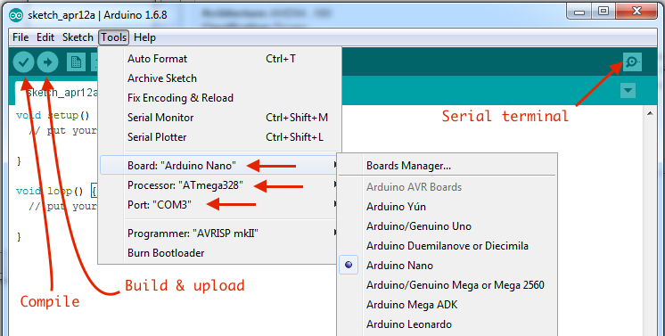
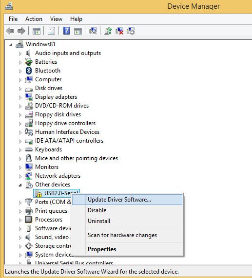

##Arduino IDE
Un fel de CodeBlocks (cu bune și rele)

###Instalare
Mediul de dezvoltare: https://www.arduino.cc/download_handler.php


Se instalează:
 - un driver pentru portul serial 
 - un compilator pentru acest microcontroler
 - o aplicație pentru salvarea programului compilat în MC (avrdude.exe)
 




Probleme cu driverul pt. portul serial ? 

Instaleaza USB-SERIAL CH341A :
http://catalog.update.microsoft.com/v7/site/ScopedViewRedirect.aspx?updateid=032a878e-8ca0-40d2-b7b1-936640b0eecb
 - download & extract într-un director pe HDD
 - în _Device Manager_ (click dreapta _My Computer_ -> Manage -> Device Manager)  


și selectezi directorul unde ai dezarhivat driverul. 

##Editor
Limbajul de programare este C și C++ - evident cu o mulțime de biblioteci specifice.

Nu este modul ideal de dezvoltare dar, acum în etapa noastră actuală, este mai mult decât ok.

Codul trebuie sa conțină obligatoriu aceste 2 funcții (generate default la File/New):
``` C++
void setup() {
  // put your setup code here, to run once:

}

void loop() {
  // put your main code here, to run repeatedly:

}
```
La build se mai adaugă funcția main astfel (aprox.):

``` C++
void main(){
	setup();
	while(1){
		loop();
	}
}
```

##Serial terminal - comunicare Arduino <-> PC
Iconul _Serial terminal_ (lupa din dreapta sus) - laseaza un program care-mi permite:

1. Să afișez mesajele trimise de programul scris de mine și uploadat în Arduino. Ex: Serial.println("Hello from Arduino");
2. Permite trimiterea de date către Arduino. În aplicația dezvoltată și uploadată în Arduino folosesc Serial.read(), Serial.readString(), etc.

Vezi : https://www.arduino.cc/en/Reference/Serial
