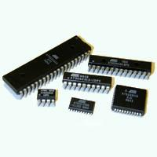
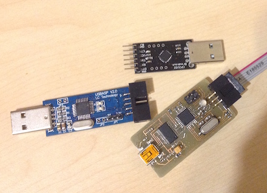
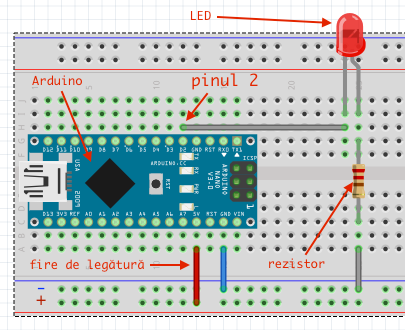
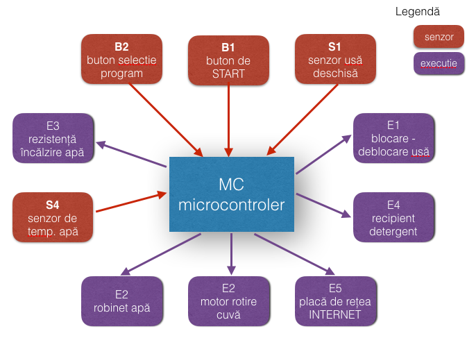

## Microcontroler - MC
Un mic calculator implementat într-un circuit integrat.



Il găsim în foarte multe aparate din jurul nostru: televizor, telefon, mașina de spălat, autoturism, etc. și reprezintă _"creierul"_ acestor aparate - practic rulează un program care pe baza datelor de intrare furnizate de diverși senzori sau butoane controlează și comandă buna desfășurare a unui proces.

Pentru al programa:
  - scriem codul aplicație într-un limbaj de programare (ex: C sau C++)
  - îl compilăm cu un compilator care generează cod executabil pentru acel MC
  - scriem programul în MC (upload) cu ajutorul unui programator (circuit electronic care face interfață între PC și MC). Uite câteva programatoare:
    


MC-ul comunică cu exteriorul prin intermediul pinilor (piciorușele care le vedeți în prima imagine). Cu câteva excepții (ex: pentru alimentare) pinii putem sa-i folosim cum dorim.

Evident în procedura de inițializare (din programul scris de noi) MC trebuie sa știe care pini dorim să-i folosim:
 - ca pini de intrare (INPUT PIN) - unde vom atașa senzori/butoane -> elemente de intrare
 - ca pini de ieșire (OUTPUT PIN) - unde vom atașa elemente de execuție - ex: led, afișaj, releu, motor.
 In realitate majoritatea elementelor de execuție au nevoie de un circuit electric/electronic adaptor - asta deoarece curentul livrat de MC este foarte mic de ordinul mA (Ex: max 40 mA/pin dar nu mai mult de 200 mA per total MC)




În circuitul de mai sus LED-ul (acel beculeț) se aprinde și se stinge periodic deoarece în MC a fost încărcat următorul program (pseudo cod inventat):

```
	void main(){
	
		cfg_PinMode(2, OUTPUT); 		// setăm pinul 2 ca pin de iesire
		
		while(1){
			set_PinValue(2, HIGH); 		//pune tensiune (+5V) pe pinul 2
										//acum intre pinul 2 și GND (-) avem ~5V (led-ul este aprins)
										
			delay(1000 /* milisec*/);	//așteaptă 1 sec 
			
			set_PinValue(3, LOW); 		//pune 0V pe pinul 2 
										//acum intre pinul 2 și GND(-) avem ~0V  (led-ul este stins)

			delay(1000 /* milisec*/);	//așteaptă 1 sec             
		}		
	}
```


### Senzor 
 Denumire generică a unui dispozitiv - circuit electric/electronic care reacționează (ex: generează o tensiune sau își modifică rezistența) la anumite proprietăți fizice sau chimice ale mediului din preajma lui.

Ex: 
  Senzor de temperatură, umiditate (aer, sol), zgomot, prezență (PIR), distanță, gaz, presiune, curent, culoare, etc.

Fiecare senzor sau element de execuție la un pin (sau mai multi) al MC-ului).
 

#### Schema bloc a unei mașini de spălat
 


Ex: La mașina noastră de spălat - programatorul a scris un program care simplist efectuează următoarele operații:

 1. așteptă apăsarea butonul START (B1)
 2. verifica dacă ușa este închisă (S1) - dacă nu este STOP - dacă da o blochează
 3. citește valoare din B2 (ce program de spălare a fost selectat)
 4. comanda deschiderea robinetului (E2) - da drumul la apa
 5. așteaptă pana când senzorul S3 - indica nivelul dorit de apa în cuva
 6. comanda închiderea robinetului (E2) - închide apa
 7. pornește motorul E2 - timp de 30 sec
 8. comanda pornirea rezistentei de încălzire apa (E3)
 9. când valoarea citită de senzorul de temperatură apa (S4) ajunge la valoarea prestabilită oprește încălzirea apei
 10. comanda aducțiunea de detergent (E4)
 11. Spală:
 
    ```c++
     for(int i=0; i<4;i++){
        start_Motor(E2, 500 /* rot/min */, 1 /* sens de rotație */);
        wait(1_minut);
        
        //schimba sensul de rotatie al motorului
        stop_Motor(E2);
        start_Motor(E2, 500 /* rot/min */, 0 /* sens de rotație */);
        wait(1_minut);
     }
    ```
    //Gata hainele's curate hai să le limpezim

12. Elimină apa + aduce apă curată în cuva (vezi 4 și 5).
13. Limpezire - idem ca 11 
// hai să le stoarcem
14. Elimină toată apa
15. Stoarcere:
16. 
 ```c++
 for(int i=0; i<4;i++){
    start_Motor(E2, 1800 /* rot/min */, 1 /* sens de rotație */);
    wait(0.5_minute);
    
    //schimba sensul de rotatie al motorului
    stop_Motor(E2);
    start_Motor(E2, 1800 /* rot/min */, 0 /* sens de rotație */);
    wait(0.5_minute);
 }
 ```
16. Gata - deblochează ușa și trimite o notificare pe facebook (E5 - placa de rețea - conexiune internet): "Rufele au fost spălate.".

Evident ca prin intermediul lui E5 noi putem să pornim mașina direct de pe telefon + obținem informații în timp real legate de procesul de spălare (ex: unde a ajuns sau de cât timp mai este nevoie pt. ...)

