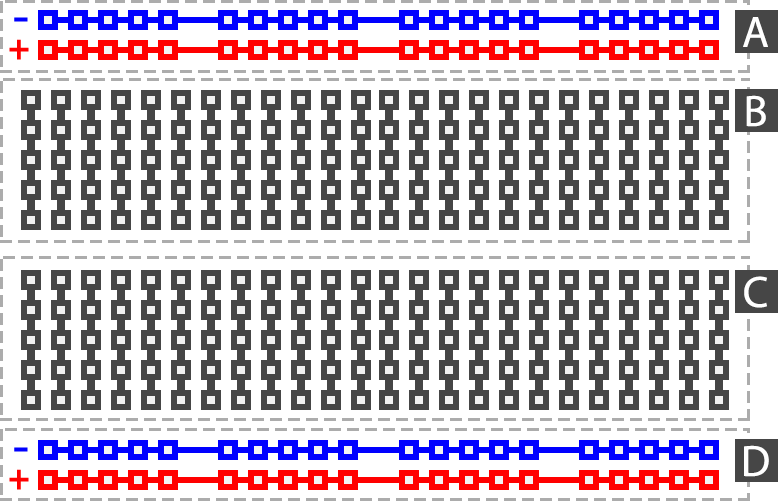

# Arduino

Platforma de dezvoltare (prototipizare) - open source (http://arduino.cc)

## Arduino nano


MC ATmega328 

- producător Atmel actual Microchip

- Flash  32k bytes (of which .5k is used for the bootloader)
        (echiv. HDD - aici este salvat programul)
- SRAM   2k bytes
        (memoria RAM - tu cât ai la calculator ?)
- EEPROM 1k byte
        (zona de memorie persistenta unde poți face diverse salvări Ex: parametrii de configurare)
- Frecventa MC: 16 Mhz

Maximum 40 mA/pin (20 mA recomandat), Cumulat (toți pinii) nu trebuie să depășească 200 mA.
 
Comunicarea **PC->Arduino** se poate face cu orice terminal serial (ex: PUTTY). Exista unul inclus în IDE (Serial terminal - icon lupă dreapta sus) 

Comunicarea **Arduino->PC** se poate face cu ajutorul clasei Serial (vezi https://www.arduino.cc/en/Reference/Serial).
 - inițializare în funcția setup:  _Serial.begin(9600 /* baud rate = viteza de comm */);_
 - transmitere valori către PC: _Serial.println("text trimis pe catre PC");_
 
Datele trimise de către Arduino vor fi afișate în terminal.

Noi programăm grupul de pini digitali și grupul _Analog pins_ (vezi imaginea de mai sus).


## Digital pins  
Se numesc _digitals pin_ deoarece pot procesa (citi sau afișa) doar una din următoarele valori: 
 - HIGH - exista tensiune (5V) pe pin față de GND (-)
 - LOW  - nu există tensiune pe pin (0V) 

Pot fi configurați ca input sau output: ` pinMode(pin, INPUT | OUTPUT);`
  
Comanda acestora se face cu funcția: ` digitalWrite(pin, HIGH | LOW); ` 
  - HIGH  => tensiune = 5V
  - LOW => tensiune = 0V


Exemplu de program:

``` C++

// LED-ul  conectat la pinul 3
#define LED_PIN 3                 

//această funcție se executa o singură dată la pornire
void setup()
{
  pinMode(LED_PIN, OUTPUT);      // configurează pinul 3 ca pin de ieșire 
}


void loop()	
{
  digitalWrite(LED_PIN, HIGH);   //pune tensiune (+5V) pe pinul LED_PIN
                                 //acum intre LED_PIN și GND (-) avem ~5V (led-ul este aprins)
                                 
  delay(1000 /* milisec*/);      //wait 1 secundă             
  
  digitalWrite(LED_PIN, LOW);    //pune 0V pe pinul LED_PIN 
                                 //acum intre pinul LED_PIN și GND(-) avem ~0V  (led-ul este stins)
  
  delay(1000);                   //wait 1 secundă
  
}

```

Funcția main() este generată automat de către mediu și are forma (aprox):

``` C++
void main(){
    setup();
    while(1){
        loop();
    }    
}
```

Haideți să-l construim.

## Breadboard-ul:



În imaginea de mai sus este ilustrată legătura dintre perforațiile (găurile) breadbopardului.

## LED


**ATENȚIE: nu se poate conecta direct la 5V.**

În catalogul producătorului sunt date caracteristicile de utilizare (pt. ledu-urile noastre portocalii):
 - tensiunea de alimentare este 2.4 V
 - curentul de funcționare: ~18 mA 

Vom monta un rezistor în serie cu led-ul care are rolul de a limita curentul prin led.

Căderea de tensiune (dorită) pe rezistor => 5V - 2.4V  = 2.6V

Știind curentul care străbate circuitul (18mA) aplicând legea lui Ohm R = U/I => R = 2.6V/0.018A =  144 Ohm

Noi vom pune o rezistență de 200 Ohm.


Google: _rezistor color code_

## Schema montajului


### Verificăm cu mare atenție montajul înainte de a-l alimenta (prin mufa USB). Atenție la scurtcircuite!


