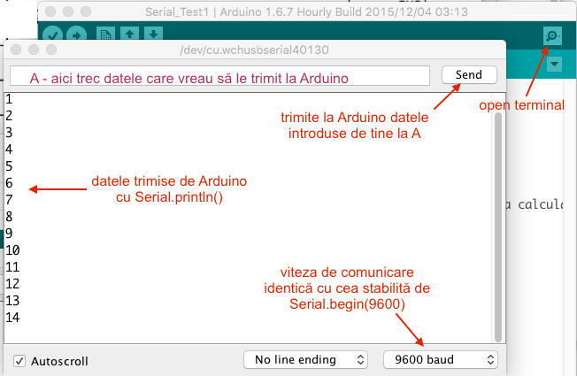

### Comunicare Arduino <-> Calculator 
Comunicarea se face folosind pinii digitali 0 (RX) si 1 (TX) si la calculator prin portul USB.
Trimiterea de date către calculator sau citirea datelor trimise de calculator se face cu _clasa_ Serial.

Clasa = ce este acesta ? Caută pe net: Object Oriented Programming.

Ca să înțelegi : poți să asimilezi (momentan) clasa ca find o structură un pic mai șmecheră - ex: conține funcții.

``` c++
struct Elev{			//structura mea elev
    char nume[20];

    void Speak(){       // functie !!!
        std::cout << "My name is " << nume << '\n';

    }
};

int main(){
    Elev a,b; 			//2 variabile de tip Elev
    
    strcpy(a.nume, "Ionel");    
    strcpy(b.nume, "Marcela");

    a.Speak();			//apelul funției Speak definită in structura Elev
    b.Speak();
}
```

Rezultatul cred că-l bănuiți:

``` 
My name is Ionel
My name is Marcela
```

Funcții definite in clasa `Serial`: (vezi si aici: https://www.arduino.cc/en/Reference/Serial)

`void Seria.Begin(speed)` - setează parametrii de configurare ce guverneaza comunicarea Arduino -> Calculator
 - `speed` = viteza de comunicare (in bits per second (baud) - long): 300, 600, 1200, 2400, 4800, 9600, 14400, 19200, 28800, 38400, 57600, or 115200
 - de regulă este apelată în funcția `Setup`

#### Comunicarea Arduino -> PC
 `void Seria.print(data)` - trimite la calculator `data`  
 `void Seria.println(data)` 
 
 Ex:
``` c++
Serial.print(78) gives "78"
Serial.print(1.23456) gives "1.23"
Serial.print('N') gives "N"
Serial.print("Hello world.") gives "Hello world."
```

Ex: de program:
``` c++
void setup(){
	Serial.begin(9600); 	//config viteza de comm cu PC-ul
}

int i=1;

void loop(){
	Serial.println(i++);      //trimite conținutul variabilei i la calculator
	delay(1000);
}
```

Pentru a intercepta pe calculator datele trimise de Arduino folosim o aplicatie de tip "serial terminal" - există una inclusă în Arduino IDE - o pornim cu butonul  _Serial terminal_ (lupa din dreapta sus):


#### Comunicarea PC->Arduino 
Datele le trimit de la calculator tot cu aplicatia "serial terminal" (vezi imaginea de mais sus) și în Arduino interceptez cu următoarele funcții:

`int Serial.available()`  returnează nr. de caractere (bytes) disponibile pentru citire din portul serial - 

Citire date din portul serial (https://www.arduino.cc/en/Reference/Serial):
- `Serial.read()`  
- `Serial.readString()`
- `Serial.readStringUntil()`    
- `Serial.parseInt()`  - gândeștete la cin >> n;
- `Serial.parseFloat()` 
- etc

Exemplu - comanda unui led RGB de pe calculator:
Detalii despre ledul RGB [aici](../caserola#rgb---led)

``` c++
#define PIN_RED 6
#define PIN_GREEN 5
#define PIN_BLUE 3

void setup(){
    
    Serial.begin(9600);                 //config viteza de comm cu PC-ul

    pinMode(PIN_RED, OUTPUT);
    pinMode(PIN_GREEN, OUTPUT);
    pinMode(PIN_BLUE, OUTPUT);
}

void loop(){
    if (Serial.available()){            //sau trimis date de la calculator ?

        byte red = Serial.parseInt();    //citeste un nr. din buffer. 
        byte green = Serial.parseInt();    
        byte blue = Serial.parseInt();    

        analogWrite(PIN_RED, red);
        analogWrite(PIN_GREEN, green);
        analogWrite(PIN_BLUE, blue);   
    }
}
```

Deschide un serial terminal si trimite 3 numere: 102 205 170 si apasă butonul Send - remarcă schimbarea culorii afișate de led. Ei ... ce părere ai ? 

Aruncă o privire peste toate functiile diponibile in clasa `Serial` : https://www.arduino.cc/en/Reference/Serial

