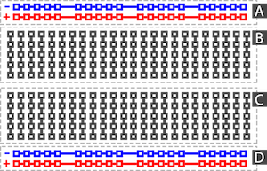
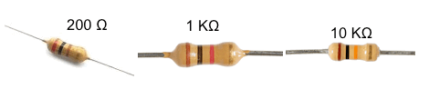
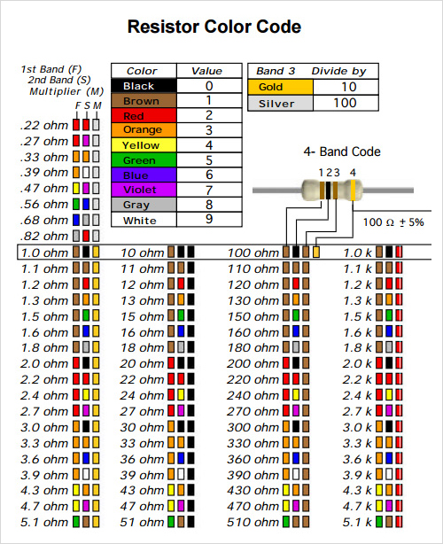
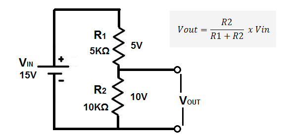
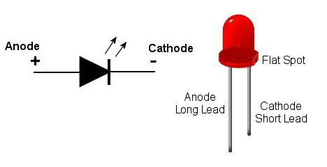
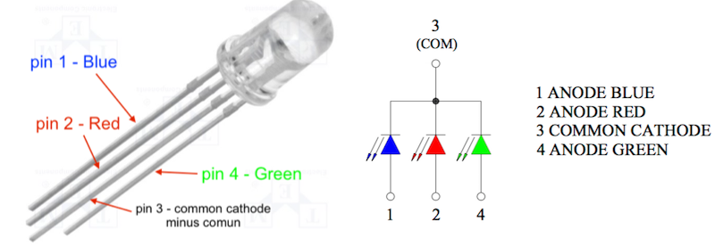
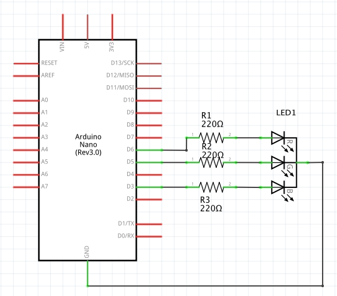

#Conținutul caserolei

##Breadboard


În imaginea de mai sus este ilustrată legătura dintre perforațiile (găurile) breadboardului.
##Resistori



Valoarea este marcata (codificat) cu acele cercuri colorate după următoarea convenție:
 (tidyforms.com)


####Divizorul de tensiune
Dacă unei grupări de rezistori înseriate i se aplica tensiunea Vin, de pe una din rezistentele grupării se poate culege o fracțiune din tensiunea aplicată, obținandu-se un divizor de tensiune (divizorul de tensiune rezistiv).



Tutorial: https://www.youtube.com/watch?v=XxLKfAZrhbM

##Led - Light Emitting Diode
  



**ATENȚIE: nu se poate conecta direct la 5V.**

În catalogul producătorului sunt date caracteristicile de utilizare (pt. ledu-urile noastre portocalii):
 - tensiunea de alimentare este 2.4 V
 - curentul de funcționare: ~18 mA 

Vom monta un rezistor în serie cu led-ul care are rolul de a limita curentul prin led.

Căderea de tensiune (dorită) pe rezistor => 5V - 2.4V  = 2.6V

Știind curentul care străbate circuitul (18mA) aplicând legea lui Ohm R = U/I => R = 2.6V/0.018A =  144 Ohm


Noi vom pune o rezistență de 200 Ohm (că de astea avem).

Dacă modificăm tensiunea de alimentare a unui LED se modifică și intensitatea lui luminoasă (Atenție să nu depășim valoarea maximă acceptată).

Putem folosi:
- `digitalWrite` - ON sau OFF led
- `analogWrite`  - cu modificare tensiune de alimentare led ( 0 (off) .... 255(maxim))


##RGB - Led 
**R**ed**G**reen**B**lue - trei led-uri într-o singură componentă 



Ledul RGB folosit de noi este produs de LUCKY LIGHT (cod: LL-509RGBM2E-002).[Link datasheet](http://www.tme.eu/ro/Document/28b9468ad2f4590fbef186695f40eaef/LL-509RGBM2E-002.pdf) (pagina care descrie caracteristicele unei componente).

Prin combinarea celor 3 culori,în proporții diferite, (alimentăm ledurile diferit folosind `analogWrite`) obținem o gamă largă de culori (vezi: https://www.google.com/#q=RGB+color+table)


http://www.mbeckler.org/microcontrollers/rgb_led/


``` c++
#define PIN_RED 6
#define PIN_GREEN 5
#define PIN_BLUE 3

void setup(){
	pinMode(PIN_RED, OUTPUT);
	pinMode(PIN_GREEN, OUTPUT);
	pinMode(PIN_BLUE, OUTPUT);
}

void loop(){
 //TBD
 
}
```


