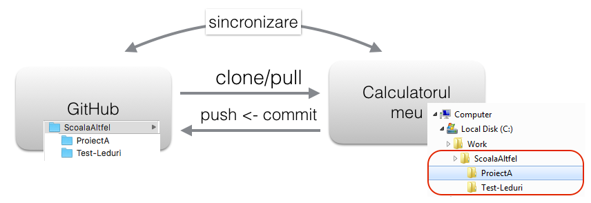

##GIT
aplicație software care are grija de surse (Source Code Management , Version Control System) - vezi pe net.

Te poți gândi ca la un dropbox cu facilitați sublime de versionare și istoric al modificărilor pentru fiecare fișier. 

##GitHub - adevăratul facebook al programatorilor. 
- aplicație web/serviciu care oferă serviciu de GIT

### Fă-ți un cont pe github (http://github.com)
 (încercă să-ți alegi un nume de user cât de cât onorabil - este cam aiurea la 35 de ani sa ai un cont de genul: bogdanelCelTareSiMare)

####A. Crează un repository

După creere te duce în pagina repo-ului. Deocamdată ai aici un singur fișier: README.md.
Fișierele cu extensia md (markdown) sunt fișiere text care conțin și câteva convenții legate de formatare - detalii pe net. 

Pentru editarea fișierelor markdown recomand: _Sublime Text 3_ (https://www.sublimetext.com/3)

####B. Instalează GitHub desktop
Aplicație client (o instalez pe calculatorul meu) care-mi permite să "sincronizez" un repo (structura de directoare și conținutul acestora) cu portalul GitHub.

Download de la adresa https://desktop.github.com/ o aplicație care o instalezi la tine pe sistem. Pasul final este să-ți introduci contul și parola de pe GitHub.

####C. Clonare repo creat la punctul A la tine pe sistem
Pornește aplicața instalată la punctul B.

La selecția butonului "Clone **ScoalaAltfel**" trebuie să selectez un director de pe HDD-ul meu unde va clona (copia) repo-ul:

La apăsarea butonului OK - tot ce am în repo-ul ScoalaAltfel de pe GitHub este copiat la mine pe sistem. In cazul meu: C:\Work\ScoalaAltfel

De acum înainte orice fișier pe care-l creez în acest director în care am clonat repo-ul (C:\Work\ScoalaAltfel) îl pot sincroniza cu GitHub-ul.

Pt. test eu am creat un director nou : ProiectA și în el un fișier README.md

####D. Commit - Sincronizarea directorului (repo-ului) local cu cel de pe GitHub:

Pornesc aplicația GitHub (instalata la pasul B):

Această aplicație o vom folosi și la școală și acasă astfel încât vom lucra mereu pe aceleași surse.

Când pleci de la școală să nu uiți să dai logout:
 - dreapta sus icon: _Tools and option_
 - din meniu selectezi: _Options_
 - în pagina Options este butonul de _LogOut_
 

####Comenzi Git

În mod normal toate aceste comenzi se rulează din linia de comandă (Git Shell):

Salvare modificari in GitHub:

1. _git commit -a -m "DESCRIERE COMMIT - UN SCURT TEXT"_ - salvează aceste modificări în istoric
2. _git push_  - trimite aceste modificări pe GitHub 

_git status_ - oferă informații legate de fișierele modificate, adăugate sau șterse

Dacă am făcut modificări la școală și le vreau și acasă: 

_git pull_ 

Toate aceste comenzi se dau in directorul repo-ului.

Și o imagine explicativă:

