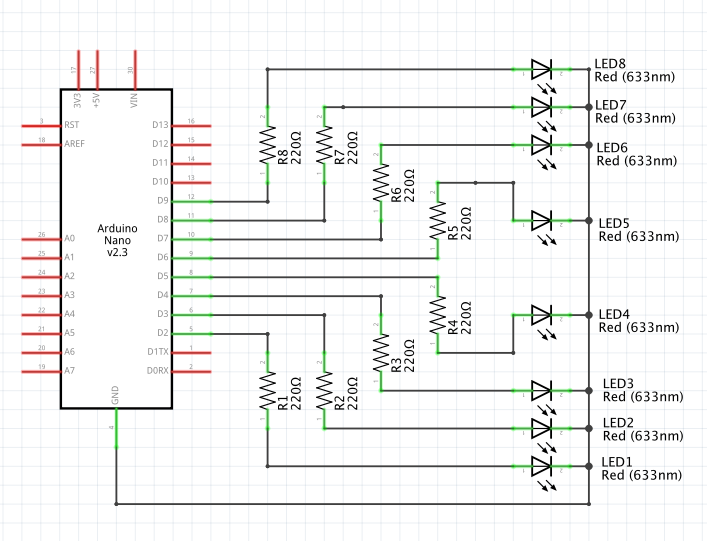

Schema montajului:



Aceasta schemă am "desenat-o" cu aplicatia fritzing (http://fritzing.org)


Video cu funcționarea:

[](https://www.youtube.com/watch?v=VA6OY-tWPuI)

Alte informații utile:

Ce coduri de formatare (markdown) am folosit la acest fisier README.md ? 

1. Pentru a include imaginea am folosit : ``.
Sintaxa este de forma:
``` markdown
    

```

2. Pentru a include video de pe youtube am folosit `[](https://www.youtube.com/watch?v=VA6OY-tWPuI)`:

Sintaxa este de forma:

``` markdown
[]
(https://www.youtube.com/watch?v=YOUTUBE_VIDEO_ID_HERE)

```

YOUTUBE_VIDEO_ID_HERE - înlocuiește acest text cu codul generat de youtube pentru videoul tau


Info legate de frizing:
- căutare component:
      
- selecție componente:
      
