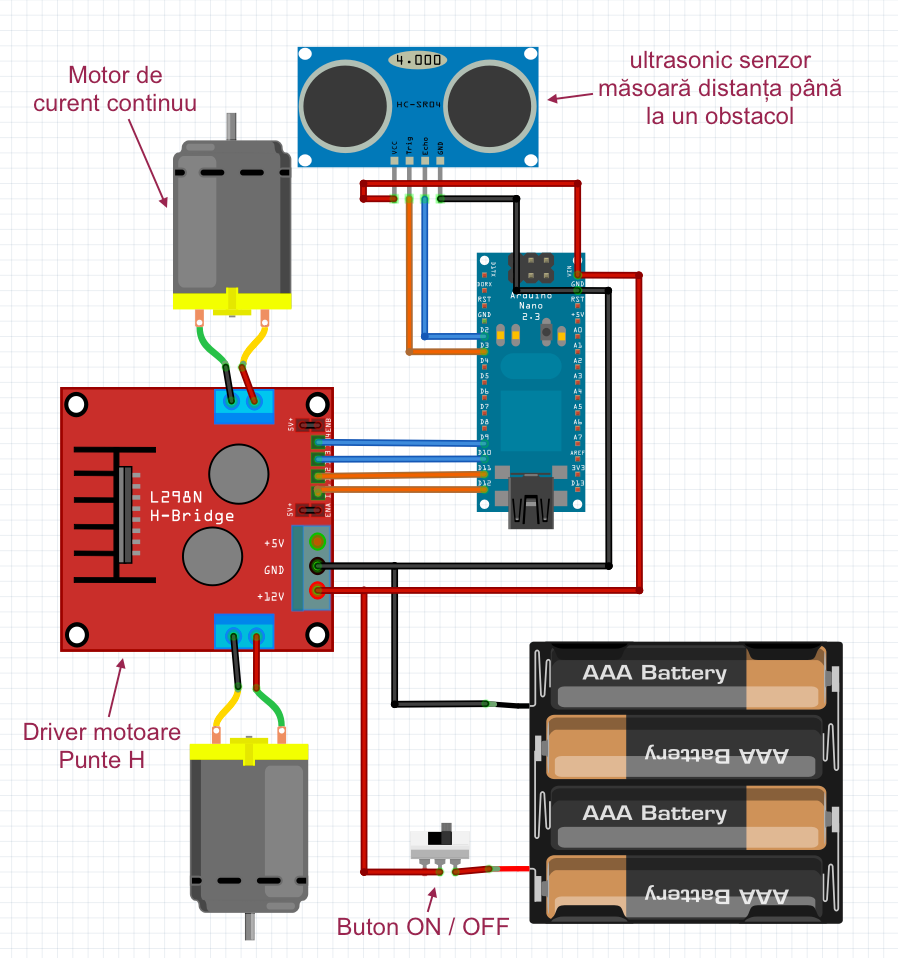

###Imaginea finală

###Layout de montaj - un fel de schemă

###Etape de montaj

####Fixăm motoarele

####Roata din spate

####Suportul pentru baterii

####H-Bridge - driver pentru motoare

####Buton ON | OFF

####Breadboard

####Conexiuni 

####Gata - deja te privește direct în ochi  ... 
