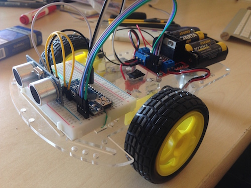
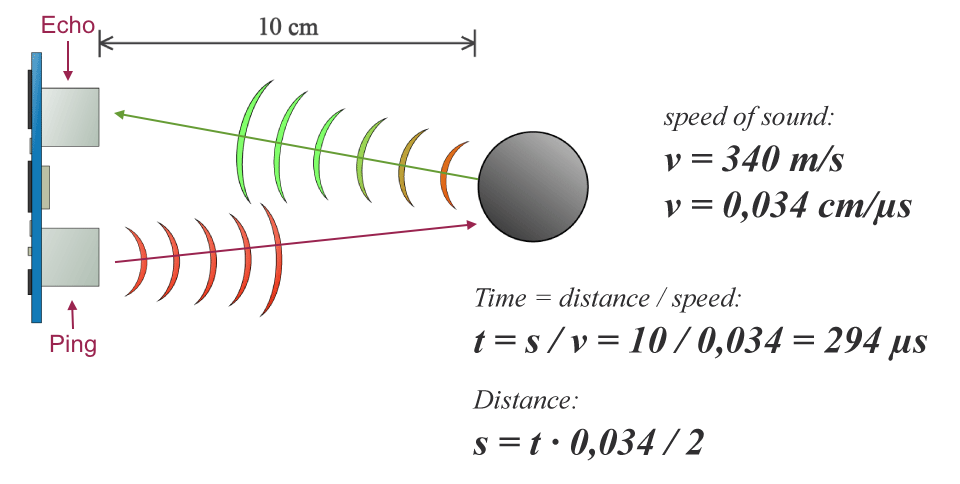

#Construim și programăm mașinuța

Detalii legate de ansablare [aici](Ansamblare.md)

#Componente noi

##Măsurarea distanței până la un obstacol - HC-SR04

Principiu de funcționare:

http://howtomechatronics.com/tutorials/arduino/ultrasonic-sensor-hc-sr04/
