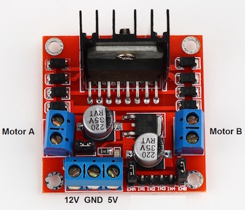

#Construim și programăm mașinuța


Detalii legate de ansablare [aici](Ansamblare.md)

#Componente noi

##HC-SR04 - măsurarea distanței până la un obstacol


Principiu de funcționare:


1. Ping:  emite un sunet cu frecvența de 40000 Hz - ultrasunet (noi nu-l putem auzi) - este un difuzor.

2. Echo: măsurăm timpul necesar intoarcerii undelor sonore reflectate (echo) - cu un fel de microfon
 
http://howtomechatronics.com/tutorials/arduino/ultrasonic-sensor-hc-sr04/

Cod simplu de test:
 - alimentati senzorul HC-SR04 (+ si -)
 - conectati pinul trig (trigger) as senzorului la pin 7 al MC-ului
 - conectati pinul echo as senzorului la pin 8 al MC-ului

``` c++
//am luat 2 pini digitali la întâmplare
const int trigger_Pin = 7;  
const int echo_Pin = 8;
 
void setup(){

    pinMode(trigger_Pin, OUTPUT);
    pinMode(echo_Pin, INPUT);           //Atenție INPIUT pin
  
    Serial.begin(9600);                 //cfg. comunicare cu calculatorul
  
}
 
void loop(){
    digitalWrite(trigger_Pin, LOW);
    digitalWrite(trigger_Pin, HIGH);    //emitem un ultrasunet
    delayMicroseconds(10);              //un delay mai minuțios    
    digitalWrite(trigger_Pin, LOW);     //stop emitere semnal
    
    long durata = pulseIn(echo_Pin, HIGH);    //măsuram durata (în microsec) 

    long dist = 0.017 * durata;          //calc. distanta 
    
    Serial.print("distanta: ");         //trimitem val. distantei la calculator
    Serial.print(dist);
    Serial.println(" cm");
    
    delay(100);
}
```

 - poți săi verifici precizia cu un liniar si un obstacol 
 - teoretic poate măsura distante cuprinse între 2 cm și 4 m (cu precizie de câțiva mm)

##H-Bridge - driver motoare

Sensul de rotatie al unui motor de curent continuu se poate schimba inversând firele de alimentare (+ cu -)

Deoarece motorașele folosite de noi consuma ~200 mA nu le putem alimenta direct din microcontroler (Arduino) - mai țineți minte un pin poate oferi maxim 40 mA. De accea folosim o placă adaptoare - driver:

 

Controlăm funcționarea motoarelor prin pinii driverului I1 ... I4:

- **IN1** și **IN2** controlează funcnționarea motorului **A** 
    - IN1 = LOW și IN2 = LOW => STOP motor **A**
    - IN1 = HIGH și IN2 = LOW => motor **A** se rotește în sensul acelor de ceasornic
    - IN1 = LOW și IN2 = HIGH => motor **A** se rotește în sensul **invers** al acelor de ceasornic
    
- **IN3** și **IN4** controlează funcnționarea motorului **B**
    - IN3 = LOW și IN4 = LOW => STOP motor **B**
    - IN3 = HIGH și IN4 = LOW => motor **B** se rotește în sensul acelor de ceasornic
    - IN3 = LOW și IN4 = HIGH => motor **B** se rotește în sensul **invers** al acelor de ceasornic

Putem concepe un mic exemplu (cod netestat):

``` c++
//Motorul A
int in1 = 10;   //conectez IN1 de la driver la pinul 10 la MC
int in2 = 9;  

//Motorul B
int in3 = 5;
int in4 = 3;

void setup()
{
    // setam toti pinii ca OUTPUT
    pinMode(in1, OUTPUT);
    pinMode(in2, OUTPUT);
    pinMode(in3, OUTPUT);
    pinMode(in4, OUTPUT);
}

void loop(){
    // porneste motor A deplasare înainte 
    digitalWrite(in1, HIGH);
    digitalWrite(in2, LOW);

    // porneste motor B deplasare înainte 
    digitalWrite(in3, HIGH);
    digitalWrite(in4, LOW);

    delay(2000);    // în timpul acestui delay motoarele merg 

    //stop motor A 
    digitalWrite(in1, LOW);
    digitalWrite(in2, LOW);

    //stop motor B 
    digitalWrite(in3, LOW);
    digitalWrite(in4, LOW);

    delay(1000);


    //Mergem cu spatele 

    // porneste motor A deplasare înapoi 
    digitalWrite(in1, LOW);
    digitalWrite(in2, HIGH);

    // porneste motor B deplasare înapoi 
    digitalWrite(in3, LOW);
    digitalWrite(in4, HIGH);

    delay(2000);    
}
```


Dezvoltarea codului mașinuței astfel încât să ocololească un obstacol pe care-l întâlnește în cale (ex: schimbă direcția la dreapta) constitue marea provocare a voastă pentru azi.

Măine dacă avem timp îl optimizăm impreună.

_Hints_: 
  - pentru eficiența organizării codului creați funcții de genul : forward, left, right, stop, back care tratează functionarea motoarelor
  - experimentați diverse valori ale distanței minime în care mașinuța poate vira

Succes
